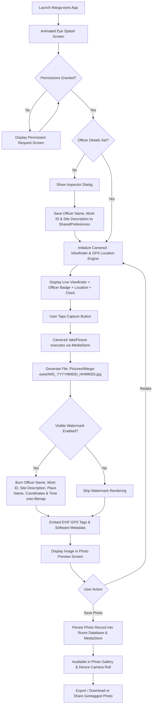

# Marga-eyes — Geotagged Camera Application Technical Documentation

## 📌 Executive Summary
**Marga-eyes** is a modern, human-crafted native Android application built in Kotlin with Jetpack Compose. It enables real-time camera capture with automatic high-precision GPS geotagging, Inspector details (Officer Name, Work ID, and Work Description), reverse-geocoded place names, embedded EXIF metadata, custom visible watermark plates burned directly onto saved photos, direct photo gallery export, and an official animated splash screen.

---

## 🛠️ Technology Stack

| Layer / Component | Technology Utilized | Version / Library |
| :--- | :--- | :--- |
| **Language** | Kotlin | `2.0.21` |
| **UI Framework** | Jetpack Compose (Material3) | `2024.10.00` BOM |
| **Splash & Graphics** | Compose Canvas (Animated Eye Symbol) | Native `androidx.compose.ui.graphics` |
| **Camera Hardware** | Android CameraX | `1.4.0` |
| **Location & GPS** | Google Play Services Location & Geocoder | `21.3.0` |
| **EXIF Engine** | AndroidX ExifInterface | `1.3.7` |
| **Watermark Engine** | Android 2D Canvas & Paint API | Native `android.graphics` |
| **Local Database** | Room Database (v4) & SharedPreferences | `2.6.1` (KSP Compiler) |
| **Storage & Export** | Android MediaStore API & FileProvider | `MediaStore.Images.Media` |
| **Image Loading** | Coil Compose | `2.7.0` |
| **Coroutines** | Kotlin Coroutines & Flow | `1.9.0` |
| **Target Android SDK** | Android 15 (API level 35) | Min SDK: `24` (Android 7.0) |

---

## 🔄 Application Workflow



---

## 📦 Required Dependencies (`app/build.gradle.kts`)

```kotlin
dependencies {
    // Jetpack Compose BOM & UI Kits
    implementation(platform("androidx.compose:compose-bom:2024.10.00"))
    implementation("androidx.compose.ui:ui")
    implementation("androidx.compose.ui:ui-graphics")
    implementation("androidx.compose.ui:ui-tooling-preview")
    implementation("androidx.compose.material3:material3")
    implementation("androidx.compose.material:material-icons-extended")

    // Activity & Navigation Compose
    implementation("androidx.activity:activity-compose:1.9.3")
    implementation("androidx.navigation:navigation-compose:2.8.3")

    // CameraX Libraries
    val cameraVersion = "1.4.0"
    implementation("androidx.camera:camera-core:$cameraVersion")
    implementation("androidx.camera:camera-camera2:$cameraVersion")
    implementation("androidx.camera:camera-lifecycle:$cameraVersion")
    implementation("androidx.camera:camera-view:$cameraVersion")

    // Google Play Services Location
    implementation("com.google.android.gms:play-services-location:21.3.0")

    // EXIF Metadata Interface
    implementation("androidx.exifinterface:exifinterface:1.3.7")

    // Room Database
    val roomVersion = "2.6.1"
    implementation("androidx.room:room-runtime:$roomVersion")
    implementation("androidx.room:room-ktx:$roomVersion")
    ksp("androidx.room:room-compiler:$roomVersion")

    // Coil Image Loading
    implementation("io.coil-kt:coil-compose:2.7.0")

    // Coroutines
    implementation("org.jetbrains.kotlinx:kotlinx-coroutines-android:1.9.0")
    implementation("org.jetbrains.kotlinx:kotlinx-coroutines-play-services:1.9.0")

    // Core KTX & Lifecycle
    implementation("androidx.core:core-ktx:1.13.1")
    implementation("androidx.lifecycle:lifecycle-runtime-ktx:2.8.6")
    implementation("androidx.lifecycle:lifecycle-viewmodel-compose:2.8.6")
}
```
